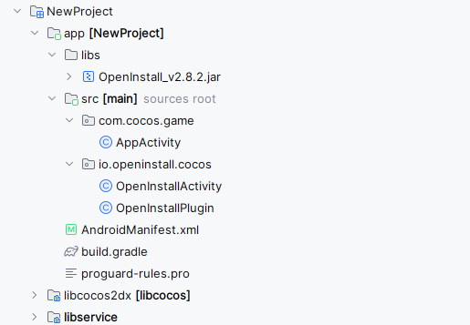

# Android 集成指南

**版本升级时会增删一些文件，请对比最新的文件，进行添加和删除**  
**版本升级时会增删一些接口，请认真查看文档进行升级**  

## 导出工程
- 在菜单 `项目` -> `构建发布` 弹框中，发布平台选择 `Android`，填写其他配置，最后点击 `构建`
- 构建完成后，使用 `Android Studio` 打开位于 `${projectDir}/build/android/proj` 的 Android 工程。

## 拷贝文件
- 将 `Android` 目录下的 `src` 文件夹下的内容拷贝到项目的 `app/src` 目录下
- 将 `Android` 目录下的 `libs` 文件下的jar文件拷贝到项目的 `app/libs` 目录下





> 注意：请开发者在进行升级时，重新拷贝并覆盖旧的文件，删除低版本SDK  

## 配置项目

### 添加应用权限

在 `AndroidManifest.xml` 中添加 `openinstall` 需要的权限

``` xml
<uses-permission android:name="android.permission.INTERNET"/>
<uses-permission android:name="android.permission.ACCESS_NETWORK_STATE"/>
```

### 配置 AppKey 和 scheme
前往 [openinstall控制台](https://developer.openinstall.io/) ，进入应用，选择 “Android集成”，切换到“Android应用配置”，获取应用的 AppKey 和 scheme。  


#### AppKey 配置
在 `AndroidManifest.xml` 的 `application` 标签中添加

``` xml
    <meta-data
        android:name="com.openinstall.APP_KEY"
        android:value="openinstall为应用分配的appkey"/>
```
#### scheme 配置
- 将启动 `AppActivity` 修改为 openinstall 提供的 `OpenInstallActivity`
- 给启动 `OpenInstallActivity` 添加 `android:launchMode="singleTask"` 属性
- 给启动 `OpenInstallActivity` 添加 `scheme` 配置

最终 `AndroidManifest.xml` 中启动页的配置大致如下
``` xml
    <activity
        android:name="io.openinstall.cocos.OpenInstallActivity"
        android:screenOrientation="sensorLandscape"
        android:configChanges="orientation|keyboardHidden|screenSize|screenLayout"
        android:label="@string/app_name"
        android:theme="@android:style/Theme.NoTitleBar.Fullscreen"
        android:launchMode="singleTask"
        android:exported="true">

        <intent-filter>
            <action android:name="android.intent.action.MAIN" />

            <category android:name="android.intent.category.LAUNCHER" />
        </intent-filter>

        <intent-filter>
            <action android:name="android.intent.action.VIEW"/>
            <category android:name="android.intent.category.DEFAULT"/>
            <category android:name="android.intent.category.BROWSABLE"/>
            <data android:scheme="openinstall为应用分配的scheme"/>
        </intent-filter>
    </activity>
```
> 不采用使用 `OpenInstallActivity` 的方式时，可以将 `OpenInstallActivity` 中的相关代码拷贝到 `AppActivity` 中；开发者升级时，也需要对照 `OpenInstallActivity` 的修改对 `AppActivity` 做相应的修改。

## 其它

#### 预初始化
预初始化函数不会采集设备信息，也不会向openinstall上报数据，需要在应用启动时调用  
**方式一：** 在 Android 原生 Application 的 `onCreate()` 中调用 
``` java
OpenInstall.preInit(getApplicationContext());
```
**方式二：** 在 cocos 工程首个组件脚本的 `OnLoad()` 中调用
```
OpenInstallPlugin.preInit()
```

#### 初始化前配置
此配置接口主要用于设置是否读取相关设备信息，需要在调用 `init` 之前调用。
``` js
    var options = {
        adEnabled : true,
        imei : "",
    }
    OpenInstallPlugin.configAndroid(options);
```
传入参数说明：   
| 参数名| 参数类型 | 描述 |  
| --- | --- | --- |
| androidId| string | 传入设备的 android_id，SDK 将不再获取 |
| serialNumber| string | 传入设备的 serialNumber，SDK 将不再获取 |
| adEnabled| boolean | 是否开启广告平台接入，开启后 SDK 将获取设备相关信息 |
| oaid | string | 通过移动安全联盟获取到的 oaid，SDK 将不再获取oaid |
| gaid | string | 通过 google api 获取到的 advertisingId，SDK 将不再获取gaid |
| imei| string | 传入设备的 imei，SDK 将不再获取 |
| macAddress| string | 传入设备的 macAddress，SDK 将不再获取 |
| imeiDisabled | boolean | 是否禁止 SDK 获取 imei（废弃，请使用 imei 配置） |
| macDisabled | boolean | 是否禁止 SDK 获取 mac 地址（废弃，请使用 macAddress 配置） |

对于上表中的设备信息，如果不想SDK获取也不想传入，请传入**空字符串**，不要传入固定无意义的非空字符串

#### 效果点明细上报
在 openinstall 控制台 的 “效果点管理” 中添加对应的效果点，并启用“记录明细”，添加自定义参数
``` js
    var extra = {
        x : "123",
        y : "abc"
    }
    OpenInstallPlugin.reportEffectPoint("effect_detail", 1, extra);
```

#### 分享统计
分享上报主要是统计某个具体用户在某次分享中，分享给了哪个平台，再通过JS端绑定被分享的用户信息，进一步统计到被分享用户的激活回流等情况。
``` lua
    _shareCallback(result){
        console.info("reportShare：shouldRetry=" + result.shouldRetry);
    }
    OpenInstallPlugin.reportShare("cc0011", "QQ", _shareCallback)
```
第一个参数是分享ID，第二个参数是分享平台。分享平台请参考 openinstall 官网文档